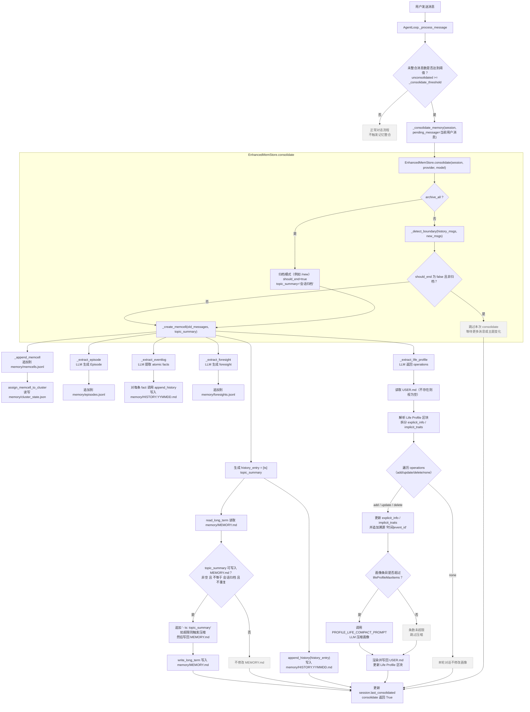

# EnhancedMem 已实现功能（nanobot-memory）

本 fork 在保留 nanobot 默认记忆（`MEMORY.md` + `HISTORY.md`）的同时，新增可选后端 **EnhancedMem**，实现更结构化的长期记忆与检索。

## 你可以得到什么

| 能力 | 说明 |
|------|------|
| **双后端切换** | 配置 `agents.defaults.memory.backend` 为 `"default"` 或 `"enhancedmem"`，行为与上游一致或使用增强记忆。 |
| **情节边界检测** | 对话按「情节」切分（主题切换、跨天、达到消息/Token 上限时），只对完整情节做记忆抽取，减少碎片。 |
| **多类型记忆** | **Episode**（情景记忆）、**EventLog**（按日历史）、**Foresight**（推断/待办）、**Life Profile**（用户画像），分别写入不同文件。 |
| **按日历史** | EnhancedMem 下历史为 `memory/HISTORY.YYMMDD.md`，便于按日浏览与 grep。检索全历史：`grep -h "关键词" memory/HISTORY.*.md`。 |
| **记忆检索** | 每次请求时，除 MEMORY.md 外还会按当前问题或最近记录拉取相关 Episode 与 EventLog 片段，一起注入上下文。 |
| **MEMORY.md 控制** | 长期摘要有字符上限（默认 6000），超出时自动压缩，保证 token 可控。 |
| **用户画像** | 从对话中抽取「显性信息」等，增量写入工作区 `USER.md`，与 SOUL.md 等 bootstrap 文件协同。 |
| **更频繁巩固** | 可配置「每 N 条消息」或「每轮对话后」尝试巩固，便于更细粒度记忆（仅 EnhancedMem 生效）。 |

## 存储与文件

- **默认后端**：`memory/MEMORY.md`、`memory/HISTORY.md`（与上游一致）。
- **EnhancedMem 后端**：
  - `memory/MEMORY.md` — 精简长期摘要（有上限与压缩）。
  - `memory/HISTORY.YYMMDD.md` — 按日事件日志（如 `HISTORY.250302.md`）。
  - `memory/memcells.jsonl` — 原始情节单元。
  - `memory/episodes.jsonl` — 情景记忆。
  - `memory/foresights.jsonl` — 推断/待办。
  - `memory/cluster_state.json` — 聚类状态（当前为按日聚类，语义向量可选）。
  - 工作区根目录 `USER.md` — 用户 Life Profile，由对话抽取更新。

## 如何启用 EnhancedMem

在 `~/.nanobot/config.json` 中设置：

```json
{
  "agents": {
    "defaults": {
      "memory": {
        "backend": "enhancedmem",
        "enhancedmem": {
          "memoryMdMaxChars": 6000,
          "memoryConsolidateIntervalMessages": null,
          "memoryConsolidateAfterTurn": false,
          "lifeProfileMaxItems": 80
        }
      }
    }
  }
}
```

- `memory.backend`: `"default"`（默认）或 `"enhancedmem"`。
- `memory.enhancedmem.memoryConsolidateIntervalMessages`: 设为数字（如 `10`）则每 10 条消息尝试巩固；`null` 则使用 `memoryWindow`。
- `memory.enhancedmem.memoryConsolidateAfterTurn`: `true` 时每轮对话后尝试巩固（更细粒度）。
- `memory.enhancedmem.lifeProfileMaxItems`: Life Profile（显性信息 + 隐性特质）条数上限，默认 80；超限时触发 LLM 压缩。

Prompt 使用中文（边界检测、Episode、EventLog、Foresight、Life Profile 等）。

## 当前未实现 / 已知限制

- **基于簇的画像**：不实现「工作·群聊」等按簇的 Profile，仅做 Life Profile（生活画像）。
- **语义聚类**：聚类目前按时间（按日），未接向量检索；配置中的 `clusterSimilarityThreshold` 等预留。
- 其他已知问题见仓库内 [MEMORY_TODO_AND_PROBLEM.md](MEMORY_TODO_AND_PROBLEM.md)。

## 与 upstream/main 同步时减少冲突的设计建议

本 fork 在 **config/schema、agent/loop、agent/context、cli/commands** 等与上游共用的文件中增加了 memory 相关逻辑，`git pull upstream main` 时容易在同一段代码上产生冲突。建议：

1. **配置层（schema）**  
   - 在 `AgentDefaults` 等共用 model 里**只做加法**：保留上游已有字段，本 fork 只新增 `memory: MemoryConfig` 等字段，避免删除或重命名上游字段。  
   - 上游新增字段（如 `reasoning_effort`）合并时**一并保留**，与 memory 配置并列。  
   - **当前实现**：`AgentDefaults` 同时包含 `memory` 与 `reasoning_effort`，符合上述规则。

2. **AgentLoop / ContextBuilder**  
   - 构造函数采用**尾部追加参数**：本 fork 的 `memory_consolidate_interval`、`memory_consolidate_after_turn` 等加在现有参数之后；上游新参数（如 `reasoning_effort`）合并时同样追加，并两处都赋值（如 `self.reasoning_effort = reasoning_effort` 与 consolidate 逻辑并存）。  
   - **ContextBuilder**：若上游只有 `workspace`，本 fork 只追加可选参数 `memory`；`build_system_prompt` 同理，只追加可选参数 `query`，不删改上游已有参数。  
   - **当前实现**：`AgentLoop.__init__` 中 consolidate 相关参数与 `reasoning_effort` 并存且均赋值；`ContextBuilder` 保留 `memory` 与 `query` 的追加式签名。

3. **CLI（commands）**  
   - 创建 AgentLoop 前用 `defaults = config.agents.defaults`，传参时统一用 `defaults.*`，并**显式传入上游新增项**（如 `reasoning_effort=defaults.reasoning_effort`），避免与上游改成 `config.agents.defaults.xxx` 的写法冲突，同时保证新参数不遗漏。  
   - **当前实现**：两处创建 AgentLoop 的代码均使用 `defaults` 并显式传入 `reasoning_effort=defaults.reasoning_effort` 及本 fork 的 `memory_store`、`memory_consolidate_interval`、`memory_consolidate_after_turn`。

4. **长期策略**  
   - 若本 fork 的 memory 逻辑继续膨胀，可考虑把 **EnhancedMem 的组装与配置** 抽到独立模块（例如 `nanobot/agent/enhancedmem/bootstrap.py` 或 `cli/memory_runner.py`），在 `commands.py` 里只保留一两处「若启用 enhancedmem 则调用该模块」，减少与上游对同一行、同一函数的修改。


## 记忆相关当前流程图

